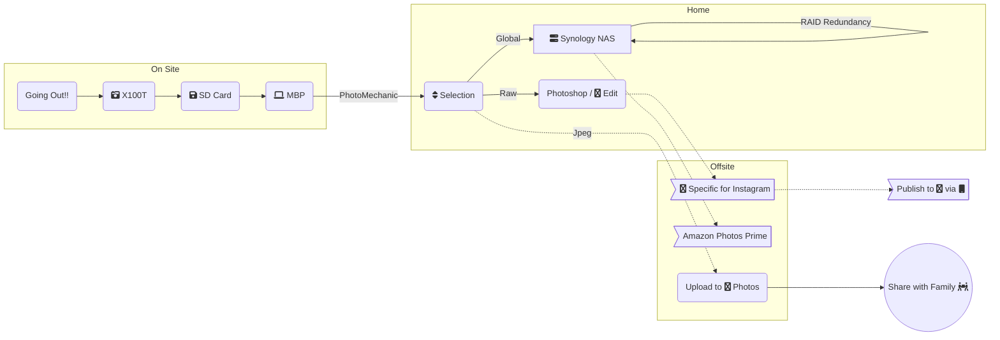

```mermaid

graph LR
 

subgraph On Site
A(Going Out!!) --> B(fa:fa-camera-retro X100T) 


	B --> C(fa:fa-save SD Card)
	C --> D(fa:fa-laptop MBP)
	end
	D -->|PhotoMechanic| E(fa:fa-sort Selection)

	subgraph Home
	E --> |Global|H[fa:fa-server Synology NAS]
	H -->|RAID Redundancy| H
	E --> |Raw|F(Photoshop / fa:fa-instagram Edit)
	
	end
	
	
	I -.-> K>Publish to fa:fa-instagram via fa:fa-mobile]
	
	
	
	subgraph Offsite
	F -.-> I>fa:fa-dropbox Specific for Instagram]
	H -.-> J>Amazon Photos Prime]
	E -.-> |Jpeg|G(Upload to fa:fa-google Photos)
	end
	
	G --> L((Share with Family fa:fa-people-carry))
	
   
  
```